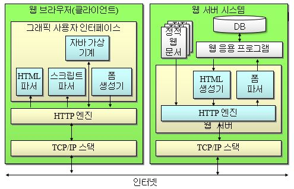

# 인터넷 구성 요소 및 제약

## 웹 서버
HTTP 프로토콜을 사용해서 클라이언트가 브라우저를 통해서 요청하는 데이터를 제공하는 인터넷 서비스 프로그램 

### 경량 웹 서버 기능
제한된 자원을 가진 시스템에 사용할 수 있도록 웹 서버의 기능을 제한하고 최적화할 필요가 있음 

> __웹 서버 기능__  
> 제한된 시스템 자원의 효율적인 사용 – 프로세스/메모리 처리 개선 
> 라즈베리파이와 쉽게 통합 및 이식성이 높아야 함 
> 웹 페이지의 동적 생성 지원 - CGI 및 서버측 스크립트 프로그램 
> 설정 가능한 보안 모델 (제거 가능) – SSL, DAA 
> 기타 로그 파일, 가상 서버, 인증 서버 등의 범용 웹 서버 기능 제한 
> __웹 서버 응용__  
> 원격 시스템 감시 - 라즈베리파이의 상태 정보나 자료를 확인 
> 원격 제어 - 동적으로 라즈베리파이의 설정 변경 

### 웹 서버 개요

      
    <b>웹 브라우저 및 서버 </b>

### 웹서버 시스템 구성
보통 __HTTP서버 + 웹응용프레임워크 + 데이터베이스__ 로 구성 (LAMP(Linux + Apache + MySQL + PHP), MAMP, WAMP) 

#### HTTP 서버

|       이름      |            사용   플랫폼           |     라이센스    |                                                                          설 명                                                                         |
|:---------------:|:----------------------------------:|:---------------:|:------------------------------------------------------------------------------------------------------------------------------------------------------:|
|      Apache     |     Unix,   Linux, Windows, Mac    |        APL      |     - 세계에서   가장   많이 사용하는 HTTP   서버     -   Perl,   Python, PHP, JSP 등   다양한 언어 지원 및 모듈 기능     -   http://www.apache.org    |
|     lighttpd    |     Unix,   Linux, Windows, Mac    |        BSD      |     - FastCGI,   SCGI, HTTP proxy, WebDAV   지원     - OpenSSL을   통한 SSL,   TLS 지원     -   http://www.lighttpd.net                                |
|       nginx     |     Unix,   Linux, Windows, Mac    |        BSD      |     - 동적   웹 페이지를 제공하는 HTTP   서버.     - 고부하(동시 10000개   접속)에도   저메모리(~2.5MB)   처리.     -   http://nginx.org/              |

#### 웹 응용 프로그램(프레임워크)
동적 웹 컨텐츠를 생성하는 __CGI 및 스크립트 프로그램__ , 웹 응용 프레임워크를 설치하여 웹 응용 프로그램을 구동 

|     사용 언어     |     종류                                                                          |
|-------------------|-----------------------------------------------------------------------------------|
|     Java          |     Struts, Wicket, Eclipse RAP,   Google Web Toolkit, JSF, JBoss Seam, Spring    |
|     Javascript    |     node.js, SproutCore                                                           |
|     Perl          |     Catalyst, Dancer                                                              |
|     PHP           |     Zend Framework                                                                |
|     Python        |     Django, Flask, Bottle, CherryPy, Grok,   Pylons, web2py                       |
|     Ruby          |     Camping,   Ruby On Rails, Sinatra                                             |

#### 데이터베이스(DB)
특정 조직의 업무를 수행하는데 필요한 상호 관련된 데이터들의 모임 

#### DBMS(DataBase Management System)
사용자와 데이터베이스 사이에서 사용자의 요구에 따라 정보를 생성해 주고 데이터베이스를 관리해주는 소프트웨어 
> __DBMS 특징(5)__  
> 1. 중복 최소화 
> 2. 데이터 공유성 
> 3. 데이터 일관성 
> 4. 데이터 무결성(정확성/정합성) 
> 5. 데이터 보안성 

__SQL 데이터베이스__  
: MySQL(오픈소스 SQL DB), SQLite(하나의 파일이나 메모리에 데이터베이스를 두는 SQL DB), MsSQL, Oracle, MariaDB, ... 
__NoSQL 데이터베이스__  
: Redis (Key/Value), MongoDB(Document), ... 
