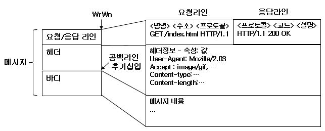

# 인터넷 구성 요소 및 제약

## 웹 서버
HTTP 프로토콜을 사용해서 클라이언트가 브라우저를 통해서 요청하는 데이터를 제공하는 인터넷 서비스 프로그램<br/>

### 경량 웹 서버 기능
제한된 자원을 가진 시스템에 사용할 수 있도록 웹 서버의 기능을 제한하고 최적화할 필요가 있음<br/>

> __웹 서버 기능__ <br/>
> 제한된 시스템 자원의 효율적인 사용 – 프로세스/메모리 처리 개선<br/>
> 라즈베리파이와 쉽게 통합 및 이식성이 높아야 함<br/>
> 웹 페이지의 동적 생성 지원 - CGI 및 서버측 스크립트 프로그램<br/>
> 설정 가능한 보안 모델 (제거 가능) – SSL, DAA<br/>
> 기타 로그 파일, 가상 서버, 인증 서버 등의 범용 웹 서버 기능 제한<br/>

> __웹 서버 응용__ <br/>
> 원격 시스템 감시 - 라즈베리파이의 상태 정보나 자료를 확인<br/>
> 원격 제어 - 동적으로 라즈베리파이의 설정 변경<br/>

### 웹 서버 개요
<p align="center">
    <br/> 
    <span><b>웹 브라우저 및 서버</b></span>
</p>

### 웹서버 시스템 구성
보통 __HTTP서버 + 웹응용프레임워크 + 데이터베이스__ 로 구성 (LAMP(Linux + Apache + MySQL + PHP), MAMP, WAMP)<br/>

#### HTTP 서버

|       이름      |            사용   플랫폼           |     라이센스    |                                                                          설 명                                                                         |
|:---------------:|:----------------------------------:|:---------------:|:------------------------------------------------------------------------------------------------------------------------------------------------------:|
|      Apache     |     Unix,   Linux, Windows, Mac    |        APL      |     - 세계에서   가장   많이 사용하는 HTTP   서버     -   Perl,   Python, PHP, JSP 등   다양한 언어 지원 및 모듈 기능     -   http://www.apache.org    |
|     lighttpd    |     Unix,   Linux, Windows, Mac    |        BSD      |     - FastCGI,   SCGI, HTTP proxy, WebDAV   지원     - OpenSSL을   통한 SSL,   TLS 지원     -   http://www.lighttpd.net                                |
|       nginx     |     Unix,   Linux, Windows, Mac    |        BSD      |     - 동적   웹 페이지를 제공하는 HTTP   서버.     - 고부하(동시 10000개   접속)에도   저메모리(~2.5MB)   처리.     -   http://nginx.org/              |

#### 웹 응용 프로그램(프레임워크)
동적 웹 컨텐츠를 생성하는 __CGI 및 스크립트 프로그램__ , 웹 응용 프레임워크를 설치하여 웹 응용 프로그램을 구동<br/>

|     사용 언어     |     종류                                                                          |
|-------------------|-----------------------------------------------------------------------------------|
|     Java          |     Struts, Wicket, Eclipse RAP,   Google Web Toolkit, JSF, JBoss Seam, Spring    |
|     Javascript    |     node.js, SproutCore                                                           |
|     Perl          |     Catalyst, Dancer                                                              |
|     PHP           |     Zend Framework                                                                |
|     Python        |     Django, Flask, Bottle, CherryPy, Grok,   Pylons, web2py                       |
|     Ruby          |     Camping,   Ruby On Rails, Sinatra                                             |

#### 데이터베이스(DB)
특정 조직의 업무를 수행하는데 필요한 상호 관련된 데이터들의 모임<br/>

#### DBMS(DataBase Management System)
사용자와 데이터베이스 사이에서 사용자의 요구에 따라 정보를 생성해 주고 데이터베이스를 관리해주는 소프트웨어<br/>
> __DBMS 특징(5)__ <br/>
> 무결성 : 부적절 자료 저장 방지<br/>
> 일관성 : 삽입/삭제/갱신/생성 후에도 데이터 (변함없이) 일정<br/>
> 회복성 : 장애 발생 시, 특정 상태 복구 성질<br/>
> 보안성 : 불법 노출/변경/손실 보호 성질<br/>
> 효율성 : (응답 시간/저장 공간 활용) 최적화 → 요구 조건 만족<br/>

__SQL 데이터베이스__ <br/>
: MySQL(오픈소스 SQL DB), SQLite(하나의 파일이나 메모리에 데이터베이스를 두는 SQL DB), MsSQL, Oracle, MariaDB, ...<br/>
__NoSQL 데이터베이스__ <br/>
: 전통적인 RDBMS와 다른 DBMS, 데이터 저장에 고정된 테이블 스키마 필요 X, 조인 연산 사용 X, 수평적 확장 가능<br/>
(Ex : Redis (Key/Value), MongoDB(Document), ...)<br/>

---

## HTTP 프로토콜

### 종단 시스템(end-system)
최종 사용자(end-user)를 위한 애플리케이션을 수행하는 주체<br/>

### 라우터(router)
종단 시스템이 속한 네트워크와 다른 네트워크를 연결함으로써 서로 다른 네트워크에 속한 종단 시스템끼리 상호 데이터를 교환할 수 있도록 하는 장비<br/>

### 종단 시스템과 라우터
<p align="center">
    <br/> 
    <span><b>시스템 간 인터넷 통신</b></span>
</p>

### 프로토콜(protocol)
종단 시스템과 라우터간, 라우터와 라우터간, 그리고 __종단 시스템과 종단 시스템간 통신을 수행하기 위한 정해진 절차와 방법__ <br/>
(네트워크 요소들 간에 상호작용을 기술하는 알고리즘과 자료구조)<br/>
__네트워크 요소들 간에 주고받는 메시지의 형식과 메시지의 수신 시 취할 동작 및 에러를 어떻게 다룰 것인가__ 를 기술<br/>

### 패킷(packet)
송수신되는 데이터의 블록, 링크 계층에서는 프레임(frame), ISO(International Standards Organization)에서는 PDU(Protocol Data Unit)<br/>
, 상위의 응용 계층에서는 메시지(message)라 함.<br/>

#### 사물 인터넷 프로토콜

|                          이름                          |                                                                                                        설명                                                                                                       |
|------------------------------------------------------|-----------------------------------------------------------------------------------------------------------------------------------------------------------------------------------------------------------------|
| Restful HTTP/HTTPS                                     | 기존의 XML-RPC/SOAP에 비해 비교적 간단한   소프트웨어 구조      GET, POST, PUT, DELETE 등을 사용      전송 데이터 포맷 : XML, JSON, 텍스트(csv) 가능      폴링, Multipart XMLHttpRequest, HTML5 웹 소켓 기법 활용 |
| MQTT      (MQ Telemetry Transport)                     | IBM 개발, 발행/구독 방식 경량 프로토콜      메시지 브로커를 통한 토픽(topic) 발행 및 구독      MQTT-SN(센서 네트워크용 프로토콜) 개발                                                                             |
| CoAP      (Constrained Application Protocol)           | TCP가 아닌 네트워크용 메시지 전송 프로토콜      주로 6LowPaN과 같은 센서 네트워크에서 사용                                                                                                                        |
| XMPP      (eXtensible Messaging and Presence Protocol) | 인스턴스 메시징 시스템에서 발전된 XML 기반   프로토콜      서비스 발견 프로토콜 포함, 다양한 IoT 응용에 적용                                                                                                      |

#### TCP/IP 프로토콜
__인터넷의 핵심 프로토콜인 TCP와 IP를 포함한 각종 프로토콜__ <br/>
운영체제에서 구현을 제공하며, 일반 애플리케이션은 운영체제가 제공하는 TCP/IP 프로토콜의 서비스를 사용하여 통신을 수행<br/>

<p align="center">
    <br/> 
    <span><b>인터넷 프로토콜 계층 구조</b></span>
</p>

#### HTTP 프로토콜
월드 와이드 웹(WWW) 상에서 정보를 주고받는 프로토콜이며 주로 HTML 문서를 주고받음, TCP/UDP 및 포트번호 80 사용<br/>
__클라이언트와 서버 사이에 요청(request) 및 응답(response) 방식의 프로토콜__ <br/>

<p align="center">
    <br/> 
    <span><b>HTTP 프로토콜 메시지 구성</b></span>
    <br/><br/>
    HTTP 프로토콜은 HTTP Request, Response 메시지로 구성되며 각 문자는 요청/응답 라인, 헤더(header), 빈 줄, 바디(body)로 구성하고<br/>
    각 부분은 <b>new line(\r\n)</b> 문자로 구분한다.<br/>
</p>

#### HTTP 요청 명령
- __GET__ : URL 주소와 함께 질의 문자열(query_string)을 함께 전달<br/>
- __POST__ : Form 위젯 등을 통해 메시지 바디에 데이터를 추가하여 전달<br/>
(전송 자료는 http:로 시작하는 URL(인터넷 주소)로 조회 가능)<br/>

|     이름       |     설 명                                                                     |
|----------------|-------------------------------------------------------------------------------|
|     HEAD       |     GET과   비슷하지만   페이지에   대한 정보(meta-information)만을   요청    |
|     GET        |     URL에   해당하는 데이터 전송을 요청                                       |
|     POST       |     서버가   처리할 수 있는 데이터(엔티티 바디) 전송                          |
|     PUT        |     해당 URL에   자료를 저장                                                  |
|     DELETE     |     해당 URL의   자료를 삭제.                                                 |
|     TRACE      |     이전에   요청한 내용을 들을 것을 요청                                     |
|     OPTIONS    |     서버가   특정 URL에   대해 어떠한 HTTP   Method를   지원하는지 요청       |
|     CONNECT    |     프록시가   사용하는 요청                                                  |

#### HTTP 요청/응답 메시지 예시
```html
GET  /index.html  HTTP/1.1
Host: test.com
User-Agent: Mozilla/2.03Gold(WinNT:  I)
Accept :  text/html
\r\n
...
```
```html
HTTP/1.0   200   OK  #200은 클라이언트 요청의 성공적인 수행 의미
Content-Type: text/html; charset=UTF-8
Content-Length: 123
\r\n
<!DOCTYPE html>
<html>
<head>
...
</html>
```

#### HTTP 응답 상태 코드

|     코드    |     상태                       |     설   명                                                                                                                                                |
|-------------|--------------------------------|------------------------------------------------------------------------------------------------------------------------------------------------------------|
|     200     |     OK                         |     클라이언트의   요청을 정상적으로 수행하였을 때 사용한다. 응답   바디(body)엔   요청과 관련된 내용을 넣어준다.                                          |
|     201     |     Created                    |     클라이언트가   요청한 리소스 생성이  성공적으로 수행되었을때 사용한다.                                                                                 |
|     202     |     Accepted                   |     클라이언트   요청이 비동기적으로 처리될 때 사용한다. 응답   바디에 처리 시간 등의 정보를 넣어준다.                                                     |
|     204     |     No   Content               |     클라이언트의   요청을 정상적으로 수행하였을 때 사용한다. 200과   다르게 204는   응답 바디가 없을 때 사용한다. 예를   들어 DELETE와   같은 요청 시      |
|     400     |     Bad   Request              |     클라이언트의   요청이 부적절할 때 사용한다. 요청   실패 시 가장 많이 사용될 상태코드로서 응답 바디에 요청이 실패한 이유를 넣어준다.                    |
|     401     |     Unauthorized               |     접근   권한을 가지지 않은 리소스를 요청했을 때 사용한다. 예를들어   로그인(login)하지   않은 사용자가 로그인시에만 요청가능한   리소스를 요청했을때    |
|     403     |     Forbidden                  |     사용자   인증상태와 관계없이 응답하고 싶지 않은 리소스를 클라이언트가 요청했을 때 사용한다.   그러나 해당 응답코드 대신 400을   사용할 것을 권고       |
|     404     |     Not   Found                |     클라이언트가   요청한 리소스가 존재하지 않을 때 사용하는 응답이다.                                                                                     |
|     405     |     Method   Not Allowed       |     클라이언트가   요청한 리소스에서는 사용 불가능한 Method를   이용했을 때 사용하는 응답이다. 읽기전용   리소스에 DELETE Method를   사용했을 때           |
|     301     |     Moved   Permanantly        |     클라이언트가   요청한 리소스에 대한 URI가   변경되었을 때 사용한다. 응답시   Location header에   변경된 URI를   적어준다.                              |
|     500     |     Internal   Server Error    |     서버에   뭔가 문제가 있을 때 사용한다.                                                                                                                 |
|     504     |     Service   Not Available    |     현재   서버에 과부하가 걸려있거나 유지보수를 위해 접근이 거부될 때 사용                                                                                |
