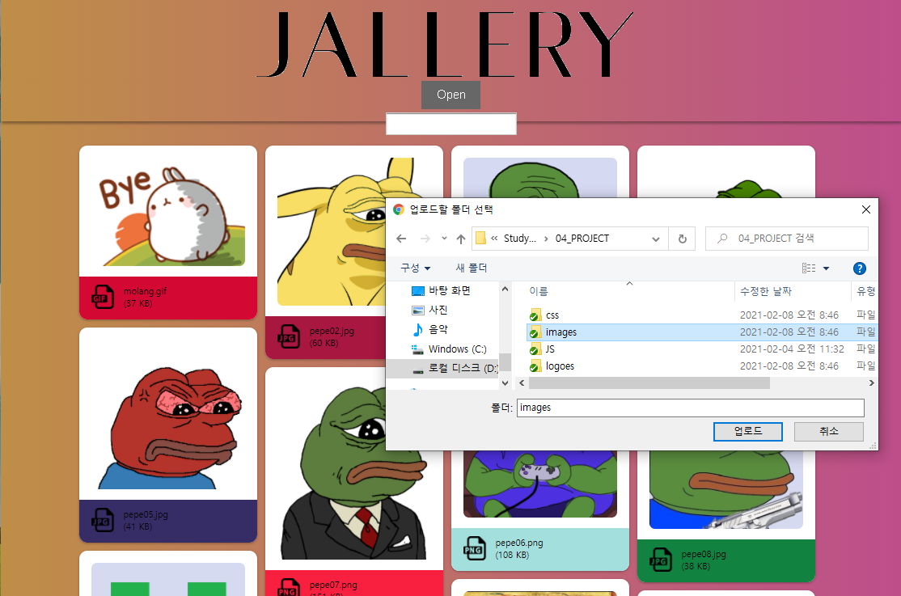
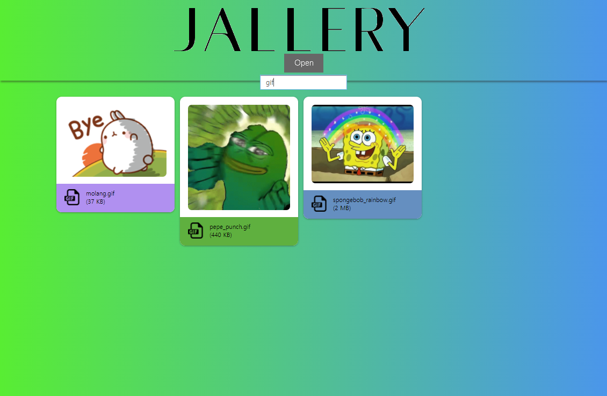
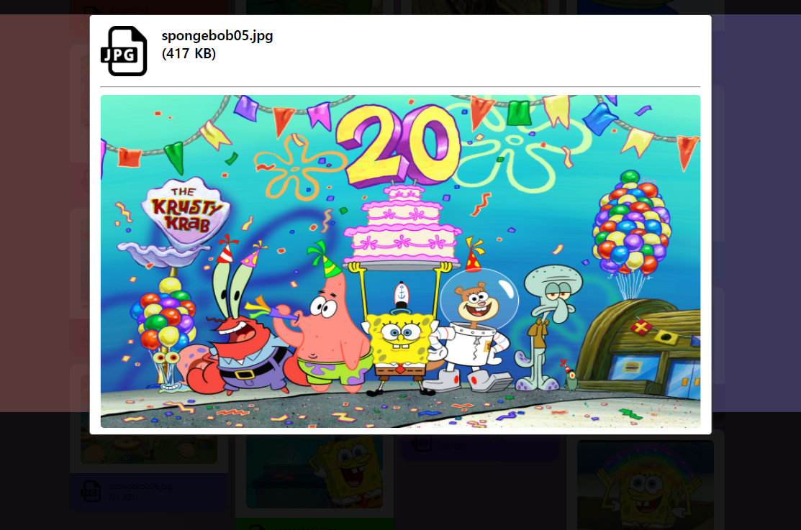

# HTML5, CSS3, JAVASCRIPT 학습 리포지토리

------------------------
## 📕인터넷 구성 요소 및 제약
인터넷 구성 요소 및 프로토콜

[요소 및 프로토콜](00_BASIC)

------------------------
## 📕HTML 5
HTML 기본 학습

[HTML 정리](01_HTML)

------------------------
## 📙CSS3
CSS 기본 학습    

[CSS 정리](02_CSS)

------------------------
## 📗Javascript
Javascript 기본 학습

[JS 정리](03_JS)

------------------------
## Project (미니 웹 홈페이지 프로젝트)

#### 🖼JALLERY 이미지 뷰어 사이트
해당 프로젝트가 위치한 곳에 있는 이미지 폴더를 불러와  
마치 이미지 갤러리처럼 이미지를 그리드 형식으로 볼 수 있는  
클라이언트 전용 웹페이지 입니다.
  
>>  
>>**- JALLERY 웹페이지에서 폴더를 선택하여 갤러리로 표현**
>     
>           
>     
>>  
>>**- JALLERY 웹페이지에서 "gif"을 검색 후 필터링하여 표현**
>   
>   
>     
>>  
>>**- JALLERY 웹페이지에서 이미지를 확대하고 좌우 방향키나 여백을 클릭하여 다음/이전 이미지로 이동**
>   
>         
>   
>[(JALLERY 웹페이지 소스)](04_PROJECT)
