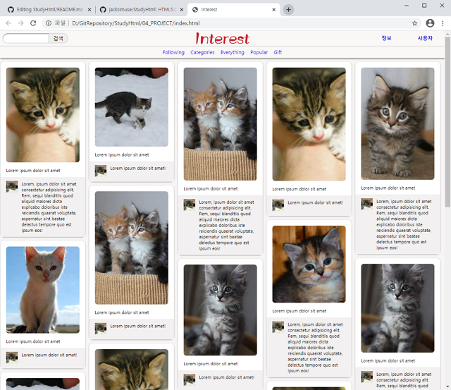
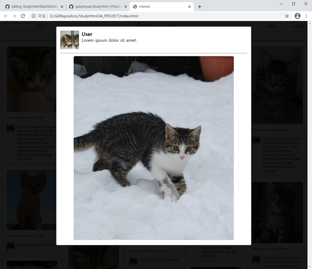

# HTML5, CSS3, JAVASCRIPT 학습 리포지토리

------------------------
## HTML 5
HTML 기본 학습

### HTML 기본 학습
[HTML 소스](01_HTML)

------------------------
## CSS3
CSS 기본 학습    

[CSS 소스](02_CSS)

------------------------
## Javascript
Javascript 기본 학습

[JS 소스](03_JS)

------------------------
## Project
미니 웹 홈페이지 프로젝트

#### JALLERY 이미지 뷰어 사이트
해당 프로젝트가 위치한 곳에 있는 이미지 폴더를 불러와  
마치 이미지 갤러리처럼 이미지를 그리드 형식으로 볼 수 있는  
클라이언트 전용 웹페이지 입니다.

[통합 프로젝트 소스](04_PROJECT)
