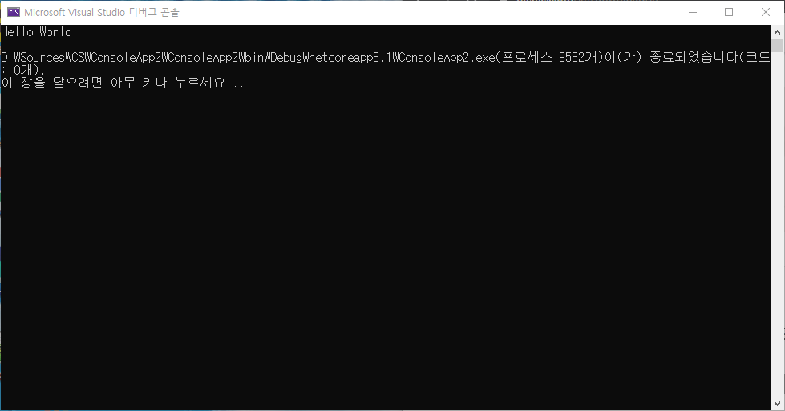

# HTML 학습 리포지토리
HTML5, CSS3, JAVASCRIPT 학습 리포지토리
>마크다운(markdown)은 일반 텍스트 기반의 경량 마크업 언어이다. 일반 텍스트로 서식이 있는 문서를 작성하는 데 사용되며, 일반 마크업 언어에 비해 문법이 쉽고 간단한 것이 특징이다. HTML과 리치 텍스트(RTF) 등 서식 문서로 쉽게 변환되기 때문에 응용 소프트웨어와 함께 배포되는 README 파일이나 온라인 게시물 등에 많이 사용된다.

-----------
## HTML5
HTML 기본 학습

### HTML이란?
개요에 대해서 학습합니다.

1. Hyper Text Markup Language 정의
2. HTML 역사
3. HTML5의 차이점

- Hyper Text Markup Language 정의
- __HTML__ _역사_
- __HTML5__의 _~차이점~_
  * UL2
  * UL3
   - UL4

- []학습하기
- []복습하기

```cs
using System;

namespace HelloWorldApp {
 public class Program {
  public static void main(String[] args) {
   Console.WriteLine("Hello World!");
   // THis is comment...
  }
 }
}
```
실행결과



</img><br/>
</img>

참조링크
- [Microsoft](https://www.microsoft.com)
- [Naver](https://www.naver.com)
- [Oracle](https://www.oracle.com)

-----------
## CSS
CSS 기본 학습

> CSS is Cascading Style Sheets.
<br/>`테스트 코드`
  
-----------
## JAVASCRIPT
Javascript 기본 학습

-----------
## Responsive Web
응답형 웹 기본 학습 (미디어쿼리)

-----------
## Project
전체 통합 프로젝트

-----------
문의메일 : <1994wjdwodbs@gmail.com>
